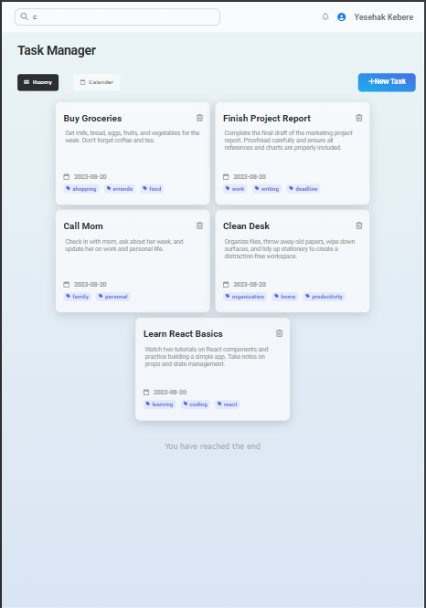
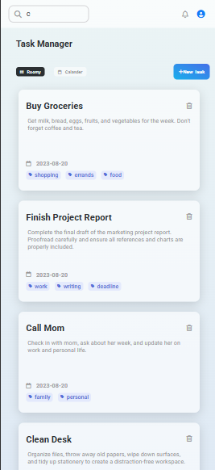
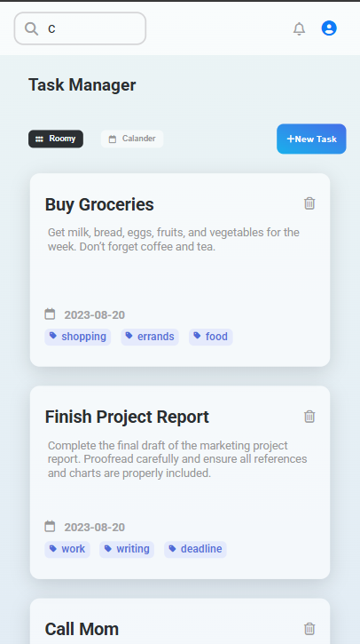

# 📝 Task Manager App  

A simple yet powerful **Task Management** application built with **React (frontend)** and **Node.js/Express (backend)**.  
Created by [@tonyk_code](https://github.com/tonyk_code) 🚀  

---

## 📂 Project Structure  

### Frontend (`/src`)  
src/
├── assets/
│ └── task-list.png
├── Components/
│ ├── AddTaskForm/
│ │ ├── AddTaskForm.css
│ │ └── AddTaskForm.jsx
│ ├── HomePage/
│ │ ├── HomePage.css
│ │ └── HomePage.jsx
│ ├── Tasks/
│ │ ├── Tasks.css
│ │ └── Tasks.jsx
│ └── utils/
│ └── loadingspinner/
│ ├── LoadingSpinner.css
│ └── LoadingSpinner.jsx
├── App.css
├── App.jsx
├── index.css
└── main.jsx


### Backend (`/routes` and core files)  

backend/
├── routes/ # All API endpoints (tasks, users, etc.)
├── server.js # Main entry point
├── config/ # DB connections & environment setup
└── controllers/ # Handles request logic

---

## 🖼 Screenshots  

(Add screenshots of your app here)  
  







---

## ⚛️ React Code (Explained Simply)  

- **`App.jsx`** → Think of it as the "main dashboard". It connects all pages and components.  
- **`HomePage.jsx`** → The welcome screen with navigation options.  
- **`Tasks.jsx`** → Displays all tasks fetched from backend.  
- **`AddTaskForm.jsx`** → A simple form that lets users add new tasks.  
- **`LoadingSpinner.jsx`** → A reusable animation while waiting for data.  

👉 In short: **React components are like Lego blocks**. Each `.jsx` file is one block, and `App.jsx` brings them together.  

---

## 🚀 Getting Started  

### 1️⃣ Clone the repo  
```bash
git clone https://github.com/tonyk_code/task-manager.git
cd task-manager

# frontend
cd task-manager-frontend
npm install

# backend
cd task-manager-backend
npm install

# start frontend
npm run dev

# start backend
npm start


🔥 Future Improvements
 Add user authentication (login/signup)

 Dark mode for UI

 Task categories and filters

 Drag & drop task ordering

 Mobile responsive UI
👨‍💻 Author

Created with ❤️ by Yesehak kebere
